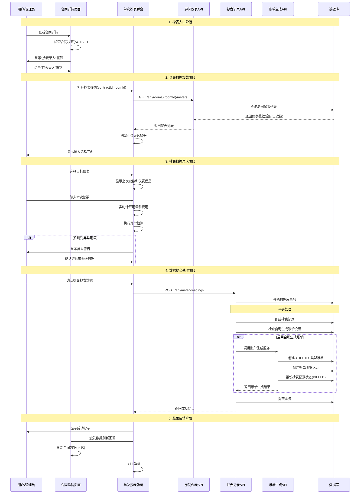

# Rento 合同详情抄表功能设计方案

## 📋 设计概述

**功能名称**: 合同详情单次抄表功能  
**设计目标**: 在合同详情页面提供针对性的单次抄表入口，解决批量抄表的操作负担问题  
**业务价值**: 精准抄表、灵活时间、简化操作、符合业务本质  

## 🎯 核心设计原则

### 1. 业务逻辑导向
- **抄表目的**: 为租客生成水电费账单，而非为了抄表而抄表
- **业务主体**: 以合同为中心，租客为对象，房间为载体
- **入口合理性**: 合同详情页面最符合"为谁抄表"的业务本质

### 2. 技术实现可行性
- **数据关联**: 合同 → 房间 → 仪表，关联链路清晰
- **现有基础**: 复用已有的`SingleMeterReadingModal`组件
- **API支持**: 利用现有的`/api/meter-readings`和`/api/rooms/[id]/meters`接口

### 3. 用户体验优化
- **操作简化**: 专注单一任务，界面简洁
- **上下文明确**: 在合同上下文中进行抄表，信息完整
- **时间灵活**: 支持不同时间点的分散抄表

## 🏗️ 系统架构设计

### 数据流程架构
```
合同详情页面 → 获取合同房间信息 → 查询房间仪表列表 → 抄表录入 → 生成账单 → 关联合同
```

### 组件层次结构
```
ContractDetailPage (合同详情页面)
├── EnhancedContractDetail (增强合同详情组件)
│   └── 操作按钮区域
│       └── "抄表录入" 按钮 (仅ACTIVE状态显示)
└── SingleMeterReadingModal (单次抄表弹窗)
    ├── 仪表选择器 (基于合同房间的仪表)
    ├── 抄表表单 (读数录入、用量计算)
    ├── 异常检测 (实时验证)
    └── 提交处理 (API调用、状态更新)
```

## 🔄 业务流程时序图



## 📊 核心功能设计

### 1. 入口设计
**位置**: 合同详情页面操作按钮区域  
**显示条件**: 仅在合同状态为`ACTIVE`时显示  
**按钮样式**: 与其他操作按钮保持一致的设计风格  

### 2. 仪表选择逻辑
**数据来源**: 通过合同的`roomId`获取房间关联的所有仪表  
**选择策略**: 默认选择第一个仪表，支持用户切换  
**信息展示**: 显示仪表类型、名称、上次读数、单价等关键信息  

### 3. 抄表录入流程
**读数输入**: 支持数字输入，实时验证格式  
**用量计算**: 自动计算 `用量 = 本次读数 - 上次读数`  
**费用计算**: 自动计算 `费用 = 用量 × 仪表单价`  
**异常检测**: 检测负数用量、异常高用量等情况  

### 4. 数据提交处理
**API调用**: 复用现有的`POST /api/meter-readings`接口  
**事务保护**: 利用现有的事务机制确保数据一致性  
**账单生成**: 根据设置自动生成UTILITIES类型账单  
**状态同步**: 自动更新抄表记录状态为`BILLED`  

## 🔧 技术实现方案

### 1. 组件复用策略
**主要组件**: 复用现有的`SingleMeterReadingModal`组件  
**API接口**: 复用现有的抄表和仪表管理API  
**数据模型**: 利用现有的MeterReading数据模型  
**业务逻辑**: 复用现有的异常检测和账单生成逻辑  

### 2. 数据关联设计
```typescript
// 数据关联链路
Contract {
  id: string
  roomId: string  // 关联房间
  status: 'ACTIVE' // 仅ACTIVE状态支持抄表
}
↓
Room {
  id: string
  meters: Meter[] // 房间关联的仪表列表
}
↓
MeterReading {
  meterId: string    // 仪表ID
  contractId: string // 合同ID (关键关联)
  // ... 其他抄表数据
}
```

### 3. 状态管理设计
**弹窗状态**: 使用`showMeterReadingModal`状态控制弹窗显示  
**加载状态**: 仪表数据加载、提交处理的loading状态  
**错误处理**: 网络错误、业务错误的统一处理机制  
**成功反馈**: 抄表成功后的提示和页面刷新  

## 🎨 用户界面设计

### 1. 入口按钮设计
**位置**: 合同详情页面操作按钮区域，与"编辑"、"续租"、"退租"等按钮并列  
**图标**: 使用`Gauge`图标，表示仪表抄表  
**文本**: "抄表录入"  
**样式**: `variant="outline"`，与其他操作按钮保持一致  

### 2. 弹窗界面设计
**标题**: "抄表录入 - {合同编号}"  
**仪表选择**: 下拉选择器，显示仪表类型和名称  
**历史信息**: 显示上次读数、抄表日期等参考信息  
**录入表单**: 本次读数输入框，实时显示计算结果  
**操作按钮**: "取消"和"提交"按钮  

### 3. 反馈机制设计
**实时验证**: 输入时实时显示用量和费用计算  
**异常警告**: 检测到异常时显示警告图标和说明  
**成功提示**: 使用`alert`显示成功信息和生成的账单信息  
**错误处理**: 网络错误或业务错误的友好提示  

## 🔒 安全和验证设计

### 1. 业务规则验证
**合同状态**: 仅允许`ACTIVE`状态的合同进行抄表  
**读数验证**: 本次读数不能小于上次读数  
**重复检查**: 防止同一仪表同一天重复抄表  
**权限控制**: 基于合同状态的操作权限控制  

### 2. 数据完整性保障
**事务处理**: 抄表记录创建和账单生成使用事务  
**关联一致性**: 确保抄表记录正确关联到合同和仪表  
**状态同步**: 抄表成功后自动更新相关状态  
**错误回滚**: 失败时自动回滚所有数据变更  

## 📈 性能和扩展性

### 1. 性能优化
**数据预加载**: 合同详情页面加载时预获取房间仪表信息  
**缓存策略**: 合理缓存仪表配置和历史读数  
**异步处理**: 账单生成采用异步处理，不阻塞用户操作  
**错误恢复**: 提供重试机制和错误恢复能力  

### 2. 扩展性设计
**多仪表支持**: 支持房间内多个仪表的选择和抄表  
**批量模式**: 预留从单次抄表扩展到小批量抄表的能力  
**自定义配置**: 支持抄表周期、异常阈值等个性化配置  
**审计追踪**: 完整的操作日志和数据追踪能力  

## 🎉 设计优势总结

### 1. 业务价值
- **精准定位**: 解决批量抄表操作负担重的问题
- **业务合理**: 入口位置符合抄表业务的本质逻辑
- **时间灵活**: 支持分散时间点的精准抄表操作
- **上下文完整**: 在合同上下文中抄表，信息更完整

### 2. 技术优势
- **复用现有**: 最大化复用现有组件和API，避免重复开发
- **架构清晰**: 数据流程清晰，组件职责明确
- **扩展性好**: 为后续功能扩展预留充足空间
- **性能优化**: 合理的数据获取和状态管理策略

### 3. 用户体验
- **操作简单**: 专注单一任务，界面简洁直观
- **反馈及时**: 实时计算和验证，即时错误提示
- **流程顺畅**: 从合同详情到抄表完成的完整闭环
- **错误友好**: 完善的错误处理和用户指导

## 🔄 与现有系统的集成

### 1. 组件集成
- **复用**: `SingleMeterReadingModal`组件已存在，仅需优化
- **扩展**: 在`EnhancedContractDetail`中添加抄表按钮
- **协调**: 与现有的编辑、续租、退租等操作按钮协调布局

### 2. API集成
- **仪表查询**: 复用`GET /api/rooms/{id}/meters`获取仪表列表
- **抄表提交**: 复用`POST /api/meter-readings`提交抄表数据
- **账单生成**: 利用现有的自动账单生成机制

### 3. 数据集成
- **关联设计**: 抄表记录通过`contractId`关联到合同
- **状态同步**: 抄表成功后自动更新合同相关状态
- **历史追踪**: 在抄表历史中可以按合同查询记录

## 📋 实施检查清单

### 前置条件验证 ✅
- [x] `SingleMeterReadingModal`组件已存在
- [x] 合同详情页面已集成抄表弹窗
- [x] 抄表API和仪表API已完善
- [x] 自动账单生成机制已就绪

### 需要优化的点
- [ ] 完善`SingleMeterReadingModal`的API调用逻辑
- [ ] 优化仪表选择和数据展示
- [ ] 增强异常检测和用户提示
- [ ] 完善成功后的数据刷新机制

### 技术约束遵循
- ✅ 复用现有API，无重复设计
- ✅ 组件代码控制在合理范围内
- ✅ 遵循现有的设计模式和最佳实践
- ✅ 充分利用现有的数据模型和业务逻辑

---

**设计版本**: v1.0  
**创建时间**: 2024年1月  
**设计状态**: 方案完成，待实施验证  
**预计实施时间**: 2-3小时（主要是优化现有组件）