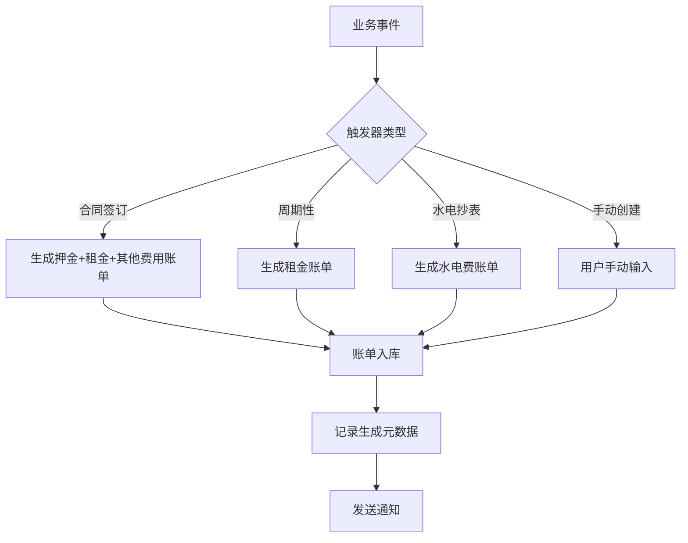

# Rento 账单自动生成系统设计文档

## 📋 系统概述

Rento 账单自动生成系统采用"自动触发为主，手动创建为辅"的设计理念，实现了智能化的账单管理。

### 🎯 设计原则

1. **自动触发为主（90%+）** - 绝大多数账单通过业务事件自动触发生成
2. **手动创建为辅（<10%）** - 仅作为特殊情况和临时费用的补充
3. **规则驱动** - 基于合同条款和系统配置自动计算
4. **可追溯性** - 完整记录生成来源和计算依据

## 🏗️ 系统架构

### 触发器类型

```typescript
enum BillTriggerType {
  CONTRACT_SIGNED = 'CONTRACT_SIGNED',     // 合同签订触发
  PERIODIC_RENT = 'PERIODIC_RENT',         // 周期性租金触发
  UTILITY_READING = 'UTILITY_READING',     // 水电抄表触发
  CONTRACT_RENEWAL = 'CONTRACT_RENEWAL',   // 合同续签触发
  MANUAL_CREATE = 'MANUAL_CREATE'          // 手动创建
}
```

### 账单生成流程



## 🔧 核心功能

### 1. 合同签订自动生成账单

**触发时机**: 合同状态变更为 `ACTIVE`

**生成规则**:
- **押金账单**: 一次性收取，到期日为合同生效日
- **首期租金**: 根据支付周期生成（月付/季付/年付）
- **其他费用**: 钥匙押金、清洁费等一次性费用

**API接口**: `POST /api/contracts/{id}/generate-bills`

```typescript
// 使用示例
const response = await fetch('/api/contracts/contract-id/generate-bills', {
  method: 'POST'
})

// 响应示例
{
  "success": true,
  "message": "成功为合同 xxx 生成 3 个账单",
  "bills": [
    {
      "id": "bill-1",
      "billNumber": "BILL001D123456",
      "type": "DEPOSIT",
      "amount": 2000,
      "dueDate": "2024-01-01",
      "status": "PENDING"
    }
    // ... 更多账单
  ]
}
```

### 2. 周期性租金账单生成

**触发时机**: 
- 合同签订时生成首期
- 定时任务检查并生成下期（提前7天）

**支付周期支持**:
- **月付**: 每月生成，金额 = 月租金
- **季付**: 每季度生成，金额 = 月租金 × 3
- **年付**: 每年生成，金额 = 月租金 × 12

**计算逻辑**:
```typescript
function calculateRentAmount(monthlyRent: number, paymentCycle: string): number {
  switch (paymentCycle) {
    case 'QUARTERLY': return monthlyRent * 3
    case 'YEARLY': return monthlyRent * 12
    default: return monthlyRent // MONTHLY
  }
}
```

### 3. 水电费自动生成

**触发时机**: 提交抄表数据

**API接口**: `POST /api/utility-readings`

**请求参数**:
```typescript
{
  "contractId": "contract-id",
  "electricityUsage": 100,      // 用电量（度）
  "waterUsage": 5,              // 用水量（吨）
  "readingDate": "2024-01-31",  // 抄表日期
  "previousReading": {...},     // 上次读数（可选）
  "currentReading": {...},      // 本次读数（可选）
  "remarks": "正常抄表"          // 备注（可选）
}
```

**计算逻辑**:
```typescript
// 使用系统设置的单价自动计算
const electricityCost = electricityUsage * settings.electricityPrice
const waterCost = waterUsage * settings.waterPrice
const totalCost = electricityCost + waterCost
```

## 📊 数据模型

### 账单元数据

每个自动生成的账单都包含完整的元数据，记录生成来源和计算依据：

```typescript
interface BillMetadata {
  triggerType: BillTriggerType    // 触发器类型
  generatedAt: string             // 生成时间
  source: string                  // 生成来源
  paymentCycle?: string           // 支付周期（租金账单）
  readingData?: {                 // 抄表数据（水电费账单）
    electricityUsage: number
    waterUsage: number
    readingDate: string
  }
  calculation?: {                 // 计算结果（水电费账单）
    electricityCost: number
    waterCost: number
    totalCost: number
  }
}
```

### 数据库字段

```sql
-- 账单表新增字段
ALTER TABLE bills ADD COLUMN metadata TEXT; -- JSON格式存储元数据
```

## 🔄 业务流程

### 合同签订流程

1. **用户操作**: 创建合同并设置状态为 `ACTIVE`
2. **系统触发**: 调用 `generateBillsOnContractSigned(contractId)`
3. **账单生成**: 
   - 解析合同条款（租金、押金、支付周期等）
   - 生成对应的账单记录
   - 记录生成元数据
4. **结果返回**: 返回生成的账单列表

### 水电抄表流程

1. **用户操作**: 提交抄表数据到 `/api/utility-readings`
2. **数据验证**: 验证合同ID、用量数据等
3. **账单生成**:
   - 获取系统设置的水电单价
   - 计算费用总额
   - 生成水电费账单
   - 记录抄表数据和计算结果
4. **结果返回**: 返回账单信息和抄表记录

### 定时任务流程

1. **定时检查**: 每日检查活跃合同
2. **判断生成**: 根据支付周期和提前天数判断是否需要生成下期账单
3. **批量生成**: 为符合条件的合同生成租金账单
4. **日志记录**: 记录生成结果和统计信息

## 🎛️ 配置管理

### 系统设置

通过 `useSettings` Hook 管理的配置项：

```typescript
interface SystemSettings {
  electricityPrice: number    // 电费单价（元/度）
  waterPrice: number         // 水费单价（元/吨）
  reminderDays: number       // 提醒提前天数
  defaultPaymentCycle: string // 默认支付周期
}
```

### 账单生成规则

```typescript
interface BillGenerationRule {
  triggerType: BillTriggerType
  billType: 'RENT' | 'DEPOSIT' | 'UTILITIES' | 'OTHER'
  autoGenerate: boolean       // 是否自动生成
  calculateMethod: string     // 计算方法
  paymentCycle?: string      // 支付周期
  advanceDays?: number       // 提前生成天数
}
```

## 🔍 监控和审计

### 生成日志

所有自动生成的账单都会记录详细的日志信息：

```typescript
// 控制台日志示例
console.log(`合同 CT202401001 自动生成 3 个账单`)
console.log(`合同 CT202401001 自动生成水电费账单: 150.50元`)
console.log(`定时任务生成了 5 个即将到期的账单`)
```

### 数据追溯

通过 `metadata` 字段可以完整追溯账单的生成过程：

- 生成时间和触发类型
- 计算依据和原始数据
- 生成来源和业务上下文

## 🚀 扩展性设计

### 新增触发器

系统支持轻松添加新的触发器类型：

1. 在 `BillTriggerType` 枚举中添加新类型
2. 实现对应的生成函数
3. 添加相应的API接口
4. 更新配置和规则

### 自定义计算规则

支持为不同的账单类型配置自定义计算规则：

- 固定金额计算
- 基于用量的计算
- 复杂的业务规则计算

## 📈 性能优化

### 批量处理

- 定时任务支持批量生成多个账单
- 使用数据库事务确保数据一致性
- 异步处理大量数据

### 缓存策略

- 系统设置缓存，减少数据库查询
- 合同信息缓存，提高生成效率

## 🔒 安全考虑

### 数据验证

- 严格的输入参数验证
- 业务规则校验
- 防止重复生成

### 权限控制

- API接口权限验证
- 操作日志记录
- 敏感操作审计

---

## 📝 总结

Rento 账单自动生成系统通过智能化的触发机制和规则驱动的计算逻辑，实现了账单管理的自动化。系统设计遵循"自动为主，手动为辅"的原则，大大提高了管理效率，同时保持了足够的灵活性来处理特殊情况。

**核心优势**:
- ✅ **高度自动化** - 90%以上账单自动生成
- ✅ **规则驱动** - 基于业务规则智能计算
- ✅ **完整追溯** - 详细记录生成过程和依据
- ✅ **灵活扩展** - 支持新增触发器和计算规则
- ✅ **用户友好** - 手动创建作为必要补充

这种设计确保了系统既能满足绝大多数标准化的账单生成需求，又能灵活应对各种特殊情况，为用户提供了最佳的使用体验。