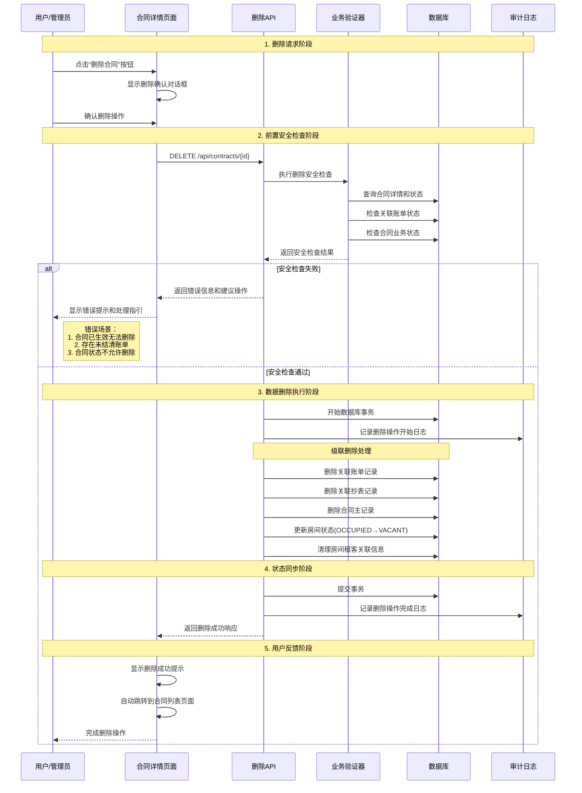

# Rento 合同删除功能设计方案 v1.0

## 合同删除业务流程时序图



## 合同删除功能核心设计要点

### 1. 业务规则设计（基于Rento实际情况）

#### 删除条件验证
- **合同状态检查**: 只有PENDING状态的合同才能直接删除
- **账单状态检查**: 不允许删除有已支付账单的合同
- **业务价值保护**: 已生效的合同应通过退租流程处理
- **数据完整性**: 确保删除操作不破坏业务数据的完整性

#### 删除类型支持
- **安全删除**: 仅删除未产生业务价值的合同（PENDING状态）
- **引导处理**: 对于ACTIVE合同，引导用户使用退租功能
- **历史保护**: 对于EXPIRED/TERMINATED合同，不允许删除以保护历史记录

### 2. 数据处理策略（复用现有删除逻辑）

#### 级联删除处理
- **账单处理**: 删除关联的未支付账单，保护已支付账单
- **抄表记录**: 删除关联的抄表记录
- **房间状态**: 重置房间状态为VACANT，清理租客关联
- **审计日志**: 完整记录删除操作的详细信息

#### 事务安全保障
- **原子性操作**: 使用数据库事务确保删除操作的原子性
- **回滚机制**: 删除失败时自动回滚所有变更
- **并发控制**: 防止同一合同被重复删除

### 3. 安全控制机制

#### 业务安全控制
- **状态验证**: 严格验证合同状态，只允许删除特定状态的合同
- **权限检查**: 确保操作用户有删除权限
- **二次确认**: 前端提供明确的删除确认机制

#### 数据安全控制
- **软删除考虑**: 对于重要合同可考虑软删除机制
- **备份保护**: 删除前自动备份关键数据
- **审计追踪**: 详细记录删除操作的时间、用户、原因等信息

## 与现有系统的集成设计

### 1. 复用现有组件和API

#### 删除安全检查复用
- **复用验证逻辑**: 参考房间删除的`performDeleteSafetyCheck`
- **复用错误处理**: 使用现有的`withApiErrorHandler`
- **复用事务管理**: 使用现有的Prisma事务处理模式

#### UI组件复用
- **复用确认对话框**: 使用现有的确认对话框组件
- **复用错误提示**: 使用现有的错误提示机制
- **复用加载状态**: 使用现有的加载状态管理

### 2. API设计规范

#### 删除API接口
```typescript
// DELETE /api/contracts/{id}
interface DeleteContractRequest {
  reason?: string  // 删除原因（可选）
}

interface DeleteContractResponse {
  success: boolean
  message: string
  deletedEntities?: {
    contract: string
    bills: string[]
    meterReadings: string[]
  }
}
```

#### 错误响应设计
```typescript
interface DeleteContractError {
  error: string
  code: 'CONTRACT_NOT_FOUND' | 'INVALID_STATUS' | 'HAS_PAID_BILLS' | 'PERMISSION_DENIED'
  details?: {
    currentStatus: string
    paidBillCount?: number
    suggestion: string
  }
}
```

### 3. 用户体验设计

#### 删除确认流程
1. **状态检查**: 实时检查合同是否可删除
2. **风险提示**: 明确告知删除的影响和后果
3. **替代建议**: 对于不可删除的合同，提供替代操作建议
4. **操作反馈**: 提供清晰的成功/失败反馈

#### 错误处理和用户引导
- **状态错误**: 提示用户合同当前状态不允许删除
- **账单冲突**: 引导用户先处理相关账单
- **权限不足**: 提示联系管理员获取权限
- **系统错误**: 提供重试机制和技术支持联系方式

## 技术实现要点

### 1. API实现结构
```typescript
// /src/app/api/contracts/[id]/route.ts
export async function DELETE(request: NextRequest, { params }: { params: Promise<{ id: string }> }) {
  // 1. 参数验证和权限检查
  // 2. 执行删除安全检查
  // 3. 执行级联删除操作
  // 4. 记录审计日志
  // 5. 返回操作结果
}
```

### 2. 安全检查函数
```typescript
// /src/lib/validation.ts
export async function performContractDeleteSafetyCheck(contractId: string) {
  // 检查合同状态
  // 检查关联账单
  // 检查业务规则
  // 返回检查结果
}
```

### 3. 级联删除函数
```typescript
// /src/lib/contract-utils.ts
export async function cascadeDeleteContract(contractId: string, options?: DeleteOptions) {
  // 使用事务执行级联删除
  // 处理关联数据
  // 更新相关状态
  // 记录操作日志
}
```

## 风险控制和最佳实践

### 1. 数据保护策略
- **最小删除原则**: 只删除确实需要删除的数据
- **历史保护**: 保护有业务价值的历史数据
- **备份机制**: 重要操作前自动备份
- **恢复能力**: 提供数据恢复的可能性

### 2. 操作审计
- **完整日志**: 记录删除操作的完整信息
- **用户追踪**: 记录操作用户和时间
- **原因记录**: 记录删除原因和业务背景
- **影响评估**: 记录删除操作的影响范围

### 3. 用户培训和文档
- **操作指南**: 提供详细的删除操作指南
- **风险说明**: 明确说明删除操作的风险和后果
- **最佳实践**: 推荐合同管理的最佳实践
- **故障排除**: 提供常见问题的解决方案

## 实施建议

### 1. 开发优先级
1. **高优先级**: API接口实现和核心安全检查
2. **中优先级**: UI交互优化和错误处理
3. **低优先级**: 高级功能和审计报告

### 2. 测试策略
- **单元测试**: 重点测试删除逻辑的正确性
- **集成测试**: 测试删除流程的完整性
- **安全测试**: 验证安全检查的有效性
- **用户测试**: 验证用户体验和操作流程

### 3. 部署策略
- **灰度发布**: 先在测试环境充分验证
- **权限控制**: 初期限制删除权限范围
- **监控告警**: 建立删除操作的监控机制
- **回滚准备**: 准备快速回滚方案

这个设计方案充分考虑了Rento项目的实际情况，复用了现有的代码架构和最佳实践，确保合同删除功能既安全可靠又符合业务需求。通过严格的安全检查和完善的错误处理，最大程度地保护了数据完整性和用户体验。