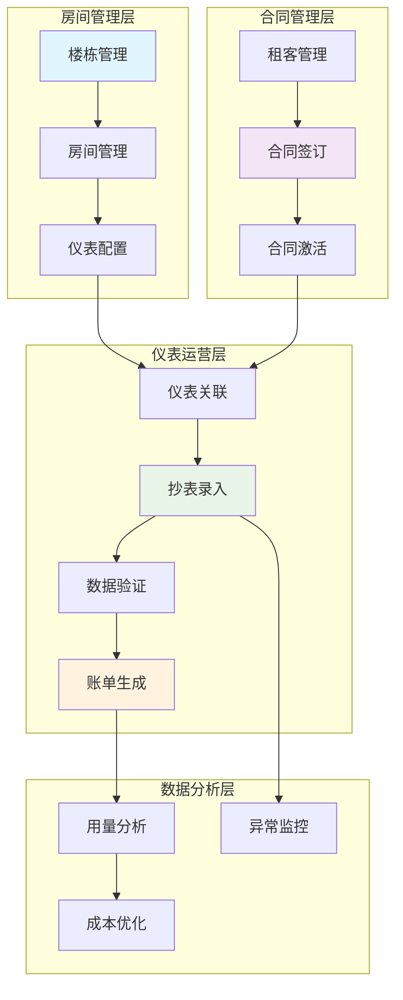
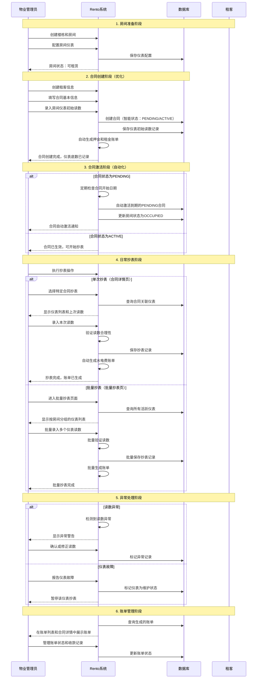
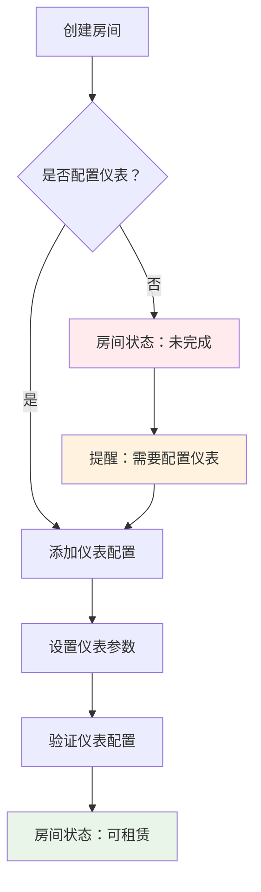
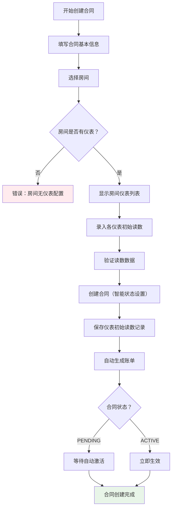
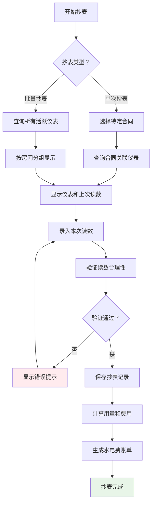

# Rento 仪表管理和抄表流程设计方案 v1.0

## 📋 问题分析

### 当前问题
1. **流程不规范**：房间创建后未强制要求配置仪表，导致抄表时发现"该房间没有仪表"
2. **关联关系混乱**：批量抄表页面显示仪表"未关联合同"，说明仪表与合同的关联逻辑存在问题
3. **系统化不足**：仪表管理功能分散在各个模块中，缺乏统一的管理流程和规范

### 根本原因
- 缺乏系统化的仪表管理流程设计
- 仪表与合同的关联关系设计不够清晰
- 业务流程管控不够严格

### 用户反馈和源代码分析

#### 1. 合同状态智能设置机制（已实现）✅
通过源代码分析确认，Rento已经实现了智能的合同状态设置机制：

```typescript
// src/lib/queries.ts - contractQueries.create()
const today = new Date()
today.setHours(0, 0, 0, 0) // 设置为当天开始时间
const startDate = new Date(data.startDate)
startDate.setHours(0, 0, 0, 0) // 设置为开始日期的开始时间

// 如果开始日期是未来日期，设为PENDING；否则设为ACTIVE
const initialStatus = startDate > today ? 'PENDING' : 'ACTIVE'
```

**智能逻辑**：
- **提前录入合同**：如果合同开始日期是未来日期，状态设为`PENDING`
- **当日生效合同**：如果合同开始日期是今天或过去日期，状态设为`ACTIVE`
- **自动激活机制**：系统有`ContractActivationService`定期检查并激活到期的PENDING合同

#### 2. 用户建议的优化方向
基于对现有设计的理解，用户提出了更实用的建议：
- **合同创建时录入仪表底数**：在添加合同时提供仪表初始读数录入功能
- **避免重复操作**：避免"签合同→再抄表"的繁琐流程
- **简化业务流程**：将仪表底数录入整合到合同创建流程中

### 优化方案概述
基于用户反馈和现有系统分析，我们对仪表管理流程进行以下优化：
- **保留智能状态设置**：继续使用现有的PENDING/ACTIVE智能状态机制
- **增强合同创建流程**：在合同创建时增加仪表初始读数录入功能
- **优化仪表关联时机**：将仪表底数录入整合到合同创建过程中
- **专注管理端功能**：移除不必要的租客通知功能

## 🌟 最佳实践调研

基于对物业管理和租赁管理系统的调研，仪表管理的最佳实践包括：

### 1. 仪表生命周期管理
- **安装配置阶段**：房间投入使用前必须完成仪表配置
- **运行监控阶段**：定期抄表、异常检测、维护保养
- **更换升级阶段**：仪表故障更换、技术升级

### 2. 数据关联模型
- **房间-仪表关联**：一个房间可以有多个仪表，仪表属于特定房间
- **合同-抄表关联**：抄表记录关联到具体合同，用于账单生成
- **仪表-读数关联**：每个仪表有历史读数记录，支持用量计算

### 3. 业务流程规范
- **标准化抄表周期**：月度、季度等固定周期
- **异常处理机制**：读数异常、仪表故障的处理流程
- **账单生成规则**：基于抄表数据自动生成水电费账单

## 🏗️ Rento 仪表管理系统设计方案

### 1. 系统架构设计



### 2. 业务流程时序图



### 3. 数据模型优化建议

#### 3.1 当前数据模型分析
Rento当前的数据模型已经比较完善：
- ✅ `Meter` 模型：包含仪表基本信息、配置和房间关联
- ✅ `MeterReading` 模型：包含抄表记录和合同关联
- ✅ `Bill` 和 `BillDetail` 模型：支持聚合账单生成

#### 3.2 需要优化的关联关系

```typescript
// 建议增强的仪表-合同关联逻辑
interface MeterContractAssociation {
  meterId: string
  contractId: string
  startDate: Date        // 关联开始时间
  endDate?: Date         // 关联结束时间
  initialReading: number // 初始读数
  status: 'ACTIVE' | 'INACTIVE' | 'TRANSFERRED'
}
```

### 4. 核心业务流程设计

#### 4.1 房间仪表配置流程



#### 4.2 合同创建时的仪表底数录入流程（优化）



#### 4.3 抄表业务流程



### 5. 关键功能实现方案

#### 5.1 合同创建时的仪表底数录入机制（优化）

```typescript
// 合同创建时同步处理仪表底数录入
async function createContractWithMeterInitialReadings(contractData: ContractCreateData) {
  return await prisma.$transaction(async (tx) => {
    // 1. 验证房间仪表配置
    const meters = await tx.meter.findMany({
      where: { 
        roomId: contractData.roomId,
        isActive: true 
      }
    })
    
    if (meters.length === 0) {
      throw new Error('房间未配置仪表，无法创建合同')
    }
    
    // 2. 创建合同（使用现有的智能状态设置）
    const today = new Date()
    today.setHours(0, 0, 0, 0)
    const startDate = new Date(contractData.startDate)
    startDate.setHours(0, 0, 0, 0)
    
    // 智能状态设置：未来日期为PENDING，当前或过去日期为ACTIVE
    const initialStatus = startDate > today ? 'PENDING' : 'ACTIVE'
    
    const contract = await tx.contract.create({
      data: {
        ...contractData,
        status: initialStatus
      },
      include: { room: true }
    })
    
    // 3. 为每个仪表创建初始读数记录（作为仪表底数）
    for (const meter of meters) {
      const initialReading = contractData.meterInitialReadings?.[meter.id] || 0
      
      await tx.meterReading.create({
        data: {
          meterId: meter.id,
          contractId: contract.id,
          currentReading: initialReading,
          previousReading: null,
          usage: 0,
          unitPrice: meter.unitPrice,
          amount: 0,
          readingDate: contract.startDate,
          status: 'CONFIRMED',
          operator: contractData.operator || 'SYSTEM',
          remarks: '合同创建时的仪表底数'
        }
      })
    }
    
    // 4. 自动生成押金和租金账单
    await generateBillsOnContractSigned(contract.id)
    
    // 5. 如果合同为ACTIVE状态，立即更新房间状态
    if (initialStatus === 'ACTIVE') {
      await tx.room.update({
        where: { id: contractData.roomId },
        data: {
          status: 'OCCUPIED',
          currentRenter: contract.renter.name
        }
      })
    }
    
    return contract
  })
}

// 扩展合同创建数据接口
interface ContractCreateData {
  // ... 现有字段
  meterInitialReadings?: Record<string, number>  // 仪表初始读数（底数）
  operator?: string  // 操作员
}
```

#### 5.2 批量抄表页面优化

```typescript
// 优化批量抄表数据查询
async function getBatchMeterReadingData() {
  const rooms = await prisma.room.findMany({
    where: {
      meters: {
        some: {
          isActive: true
        }
      },
      contracts: {
        some: {
          status: 'ACTIVE'
        }
      }
    },
    include: {
      building: true,
      meters: {
        where: { isActive: true },
        include: {
          readings: {
            orderBy: { readingDate: 'desc' },
            take: 1
          }
        }
      },
      contracts: {
        where: { status: 'ACTIVE' },
        include: {
          renter: true
        }
      }
    }
  })
  
  // 为每个仪表添加合同关联信息
  return rooms.map(room => ({
    ...room,
    meters: room.meters.map(meter => ({
      ...meter,
      contractId: room.contracts[0]?.id || null,
      contractNumber: room.contracts[0]?.contractNumber || null,
      renterName: room.contracts[0]?.renter?.name || null
    }))
  }))
}
```

#### 5.3 抄表数据验证增强

```typescript
// 增强的抄表数据验证
function validateMeterReading(
  currentReading: number,
  lastReading: number,
  meterType: MeterType,
  settings: GlobalSettings
) {
  const validationResult = {
    isValid: true,
    warnings: [] as string[],
    errors: [] as string[]
  }
  
  // 1. 基础验证
  if (currentReading < lastReading) {
    validationResult.errors.push('本次读数不能小于上次读数')
    validationResult.isValid = false
  }
  
  // 2. 用量异常检测
  const usage = currentReading - lastReading
  const threshold = settings.usageAnomalyThreshold || 100
  
  if (usage > threshold) {
    validationResult.warnings.push(
      `用量异常偏高：${usage}，请确认读数是否正确`
    )
  }
  
  // 3. 零用量检测
  if (usage === 0) {
    validationResult.warnings.push('用量为0，请确认仪表是否正常工作')
  }
  
  // 4. 仪表类型特定验证
  switch (meterType) {
    case 'ELECTRICITY':
      if (usage > 1000) {
        validationResult.warnings.push('电表用量异常偏高，请核实')
      }
      break
    case 'COLD_WATER':
    case 'HOT_WATER':
      if (usage > 50) {
        validationResult.warnings.push('水表用量异常偏高，请核实')
      }
      break
  }
  
  return validationResult
}
```

### 6. 用户界面优化建议

#### 6.1 房间管理页面增强
- 在房间列表中显示仪表配置状态
- 提供"一键配置标准仪表"功能
- 房间状态标识：已配置仪表/未配置仪表

#### 6.2 合同管理页面增强
- 合同激活前检查房间仪表配置
- 显示合同关联的仪表信息
- 提供仪表关联状态查看

#### 6.3 批量抄表页面优化
- 按楼栋和房间分组显示
- 显示合同信息和租客姓名
- 提供仪表状态筛选功能
- 支持导入/导出抄表数据

### 7. 实施建议

#### 7.1 短期优化（1-2周）
1. **增强合同创建流程**
   - 在合同创建表单中添加仪表初始读数（底数）录入功能
   - 保留现有的智能状态设置机制（PENDING/ACTIVE）
   - 合同创建时同步保存仪表底数记录

2. **完善数据验证**
   - 强制要求房间配置仪表后才能创建合同
   - 添加仪表底数录入的数据验证规则
   - 增强异常检测和警告提示

#### 7.2 中期完善（1个月）
1. **流程规范化**
   - 完善合同激活服务的自动化机制
   - 实现标准化的抄表周期管理
   - 优化PENDING合同的管理界面

2. **用户体验优化**
   - 优化合同创建表单的仪表底数录入体验
   - 改进批量抄表页面的交互体验
   - 添加仪表管理的统一入口

#### 7.3 长期规划（3个月）
1. **智能化功能**
   - 基于历史数据的用量预测
   - 异常用量自动检测和报警
   - 智能抄表提醒机制

2. **数据分析**
   - 用量趋势分析
   - 成本优化建议
   - 仪表使用效率分析

### 8. 技术实现要点

#### 8.1 数据库优化
```sql
-- 添加仪表-合同关联索引
CREATE INDEX idx_meter_readings_contract_meter ON meter_readings(contractId, meterId);
CREATE INDEX idx_meters_room_active ON meters(roomId, isActive);
```

#### 8.2 API接口优化
- 优化批量抄表数据查询性能
- 增加仪表关联状态查询接口
- 实现抄表数据批量验证接口

#### 8.3 缓存策略
- 缓存房间仪表配置信息
- 缓存最新抄表记录
- 缓存全局设置参数

## 🎯 预期效果

### 业务效果
1. **流程简化**：将仪表底数录入整合到合同创建流程，避免重复操作
2. **智能管理**：保留现有的智能状态设置，支持提前录入和自动激活
3. **数据准确性**：通过在合同创建时录入底数，确保抄表基准的准确性
4. **操作效率**：减少"签合同→再抄表"的繁琐步骤，提升管理效率

### 技术效果
1. **系统稳定性**：通过事务机制确保合同创建和仪表底数录入的数据一致性
2. **兼容性保持**：保留现有的PENDING/ACTIVE智能状态机制，向后兼容
3. **可维护性**：清晰的业务逻辑和代码结构，便于后续维护
4. **可扩展性**：为后续的智能化功能和数据分析奠定基础

### 用户体验提升
1. **操作便利**：一次性完成合同创建和仪表底数录入
2. **状态清晰**：智能状态设置让合同管理更加清晰
3. **错误减少**：减少因遗忘抄表底数导致的计费错误
4. **管理高效**：专注管理端功能，提升物业管理效率

---

**文档版本**: v2.0  
**创建时间**: 2024年1月  
**最后更新**: 2024年1月  
**状态**: 优化方案 - 基于用户反馈调整