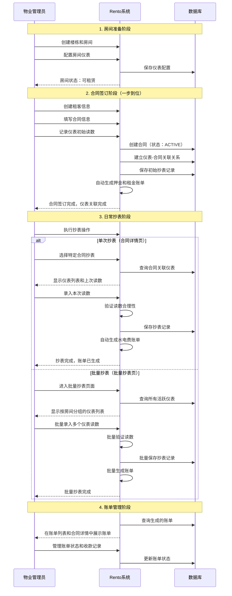
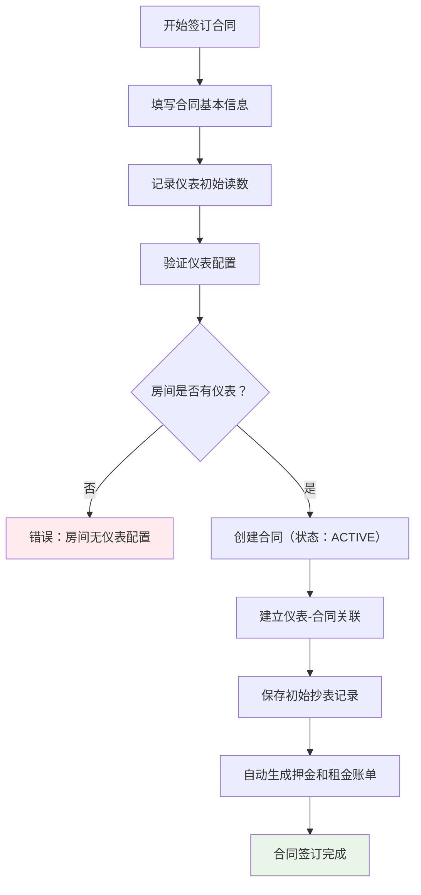

# Rento 仪表管理优化方案 v2.0

## 📋 针对用户反馈的优化调整

### 用户提出的问题
1. **合同签订时机问题**：当前设计是合同可以提前签订（PENDING状态），然后等到进入租期才激活（ACTIVE状态）并记录仪表初始读数，这在实际情况中不仅费时费力，而且不好管理。
2. **系统定位问题**：Rento当前是管理端，暂时不涉及到与用户的交互，比如发送账单通知，应该存在的账单在账单列表和合同详情内展示即可。

### 优化方案概述
基于用户反馈，我们对原有设计进行以下关键优化：
- **简化合同流程**：合同签订时直接记录仪表初始读数，创建为ACTIVE状态
- **移除激活步骤**：取消PENDING状态和后续激活的复杂流程
- **专注管理端**：移除租客通知功能，专注于管理端的账单展示和管理

## 🏗️ 优化后的系统架构

### 1. 简化的业务流程时序图



### 2. 优化后的合同-仪表关联流程



## 🔧 核心功能实现优化

### 1. 合同创建表单增强

```typescript
// 优化后的合同创建表单数据结构
interface OptimizedContractCreateData {
  // 基本合同信息
  renterId: string
  roomId: string
  contractNumber: string
  startDate: Date
  endDate: Date
  monthlyRent: number
  deposit: number
  keyDeposit?: number
  cleaningFee?: number
  paymentMethod: string
  
  // 新增：仪表初始读数（关键优化）
  meterInitialReadings: Record<string, number>  // meterId -> initialReading
  
  // 操作信息
  operator: string
  remarks?: string
}

// 合同创建表单组件增强
function EnhancedContractCreateForm() {
  const [contractData, setContractData] = useState<OptimizedContractCreateData>()
  const [roomMeters, setRoomMeters] = useState<Meter[]>([])
  
  // 当选择房间时，自动加载仪表列表
  const handleRoomChange = async (roomId: string) => {
    const meters = await fetch(`/api/rooms/${roomId}/meters`).then(r => r.json())
    setRoomMeters(meters.data || [])
    
    // 初始化仪表读数对象
    const initialReadings: Record<string, number> = {}
    meters.data?.forEach((meter: Meter) => {
      initialReadings[meter.id] = 0
    })
    setContractData(prev => ({
      ...prev,
      meterInitialReadings: initialReadings
    }))
  }
  
  // 仪表初始读数录入组件
  const renderMeterReadingsInput = () => (
    <div className="space-y-4">
      <h3 className="text-lg font-medium">仪表初始读数</h3>
      {roomMeters.map(meter => (
        <div key={meter.id} className="flex items-center space-x-4">
          <Label className="w-32">{meter.displayName}</Label>
          <Input
            type="number"
            placeholder="请输入初始读数"
            value={contractData?.meterInitialReadings?.[meter.id] || ''}
            onChange={(e) => {
              const value = parseFloat(e.target.value) || 0
              setContractData(prev => ({
                ...prev,
                meterInitialReadings: {
                  ...prev?.meterInitialReadings,
                  [meter.id]: value
                }
              }))
            }}
          />
          <span className="text-sm text-gray-500">{meter.unit}</span>
        </div>
      ))}
    </div>
  )
  
  return (
    <form>
      {/* 基本合同信息表单 */}
      {/* ... */}
      
      {/* 仪表初始读数录入 */}
      {roomMeters.length > 0 && renderMeterReadingsInput()}
      
      {/* 提交按钮 */}
    </form>
  )
}
```

### 2. 优化后的合同创建API

```typescript
// 优化后的合同创建API实现
export async function createContractWithMeterAssociation(
  contractData: OptimizedContractCreateData
) {
  return await prisma.$transaction(async (tx) => {
    // 1. 验证房间仪表配置
    const meters = await tx.meter.findMany({
      where: { 
        roomId: contractData.roomId,
        isActive: true 
      }
    })
    
    if (meters.length === 0) {
      throw new Error('房间未配置仪表，无法签订合同')
    }
    
    // 2. 验证所有仪表都有初始读数
    for (const meter of meters) {
      if (!(meter.id in contractData.meterInitialReadings)) {
        throw new Error(`仪表 ${meter.displayName} 缺少初始读数`)
      }
    }
    
    // 3. 创建合同（直接为ACTIVE状态）
    const contract = await tx.contract.create({
      data: {
        renterId: contractData.renterId,
        roomId: contractData.roomId,
        contractNumber: contractData.contractNumber,
        startDate: contractData.startDate,
        endDate: contractData.endDate,
        monthlyRent: contractData.monthlyRent,
        totalRent: calculateTotalRent(contractData),
        deposit: contractData.deposit,
        keyDeposit: contractData.keyDeposit,
        cleaningFee: contractData.cleaningFee,
        paymentMethod: contractData.paymentMethod,
        status: 'ACTIVE',  // 关键：直接创建为ACTIVE状态
        signedBy: contractData.operator,
        signedDate: new Date(),
        remarks: contractData.remarks
      },
      include: { 
        room: { include: { building: true } },
        renter: true 
      }
    })
    
    // 4. 为每个仪表创建初始抄表记录
    for (const meter of meters) {
      const initialReading = contractData.meterInitialReadings[meter.id]
      
      await tx.meterReading.create({
        data: {
          meterId: meter.id,
          contractId: contract.id,
          currentReading: initialReading,
          previousReading: null,
          usage: 0,
          unitPrice: meter.unitPrice,
          amount: 0,
          readingDate: contract.startDate,
          period: `${contract.startDate.toISOString().slice(0, 7)} 初始读数`,
          status: 'CONFIRMED',
          isBilled: false,
          operator: contractData.operator,
          remarks: '合同签订时的初始读数'
        }
      })
    }
    
    // 5. 更新房间状态
    await tx.room.update({
      where: { id: contractData.roomId },
      data: {
        status: 'OCCUPIED',
        currentRenter: contract.renter.name
      }
    })
    
    // 6. 自动生成押金和租金账单
    await generateBillsOnContractSigned(contract.id)
    
    return contract
  })
}
```

### 3. 批量抄表页面数据查询优化

```typescript
// 优化批量抄表数据查询，确保显示合同关联信息
async function getOptimizedBatchMeterReadingData() {
  const rooms = await prisma.room.findMany({
    where: {
      // 只查询有活跃仪表且有活跃合同的房间
      AND: [
        {
          meters: {
            some: { isActive: true }
          }
        },
        {
          contracts: {
            some: { status: 'ACTIVE' }
          }
        }
      ]
    },
    include: {
      building: true,
      meters: {
        where: { isActive: true },
        include: {
          readings: {
            orderBy: { readingDate: 'desc' },
            take: 1
          }
        }
      },
      contracts: {
        where: { status: 'ACTIVE' },
        include: {
          renter: true
        }
      }
    },
    orderBy: [
      { building: { name: 'asc' } },
      { floorNumber: 'asc' },
      { roomNumber: 'asc' }
    ]
  })
  
  // 为每个仪表添加完整的合同关联信息
  return rooms.map(room => {
    const activeContract = room.contracts[0] // 每个房间只有一个活跃合同
    
    return {
      ...room,
      meters: room.meters.map(meter => ({
        ...meter,
        // 关键：确保每个仪表都有合同关联信息
        contractId: activeContract?.id || null,
        contractNumber: activeContract?.contractNumber || null,
        renterName: activeContract?.renter?.name || null,
        contractStatus: activeContract?.status || null,
        // 添加最新读数信息
        lastReading: meter.readings[0]?.currentReading || 0,
        lastReadingDate: meter.readings[0]?.readingDate || null
      }))
    }
  })
}
```

## 🎯 用户界面优化建议

### 1. 合同创建页面增强
- **仪表读数录入区域**：在合同表单中添加专门的仪表初始读数录入区域
- **实时验证**：选择房间后自动检查仪表配置，如无仪表则提示先配置
- **智能提示**：为每个仪表显示类型、位置、单价等信息，帮助准确录入

### 2. 批量抄表页面优化
- **合同信息显示**：确保每个仪表都显示关联的合同编号和租客姓名
- **状态标识**：清晰标识仪表的关联状态（已关联合同/未关联合同）
- **分组展示**：按楼栋-楼层-房间层级分组展示，便于管理

### 3. 账单管理优化
- **管理端专注**：移除租客通知功能，专注于管理端的账单展示
- **详细展示**：在账单列表和合同详情中完整展示所有账单信息
- **状态管理**：提供便捷的账单状态更新和收款记录功能

## 📊 实施优先级

### 高优先级（立即实施）
1. **合同创建流程优化**
   - 在合同创建表单中添加仪表初始读数录入
   - 修改合同创建API，直接创建ACTIVE状态合同
   - 同步创建初始抄表记录

2. **移除激活步骤**
   - 删除合同激活相关的API和界面
   - 简化合同状态管理逻辑

### 中优先级（1-2周内）
1. **批量抄表页面修复**
   - 确保所有仪表正确显示合同关联信息
   - 优化数据查询性能

2. **用户界面优化**
   - 优化合同创建表单的用户体验
   - 添加必要的验证和提示

### 低优先级（后续优化）
1. **数据迁移**
   - 为现有的PENDING状态合同提供批量激活工具
   - 清理历史数据中的不一致状态

## 🔄 与现有系统的兼容性

### 数据库兼容性
- **现有数据保持不变**：不需要修改现有的数据库结构
- **状态枚举保留**：保留PENDING状态枚举，但新合同直接创建为ACTIVE
- **历史数据处理**：现有PENDING状态合同可通过工具批量激活

### API兼容性
- **向后兼容**：保留现有的合同激活API，但标记为废弃
- **新API优先**：新的合同创建流程使用优化后的API
- **渐进迁移**：逐步将现有功能迁移到新的流程

## 📝 总结

通过这次优化，我们解决了用户提出的两个核心问题：

1. **简化合同流程**：合同签订时直接记录仪表初始读数，避免了后续激活的复杂步骤，提高了管理效率。

2. **专注管理端**：移除了不必要的租客通知功能，专注于管理端的账单展示和管理，符合Rento的系统定位。

这个优化方案既保持了系统的完整性和数据一致性，又大大简化了实际操作流程，更符合物业管理的实际需求。

---

**文档版本**: v2.0  
**创建时间**: 2024年1月  
**基于**: 用户反馈优化  
**状态**: 优化方案 - 待实施