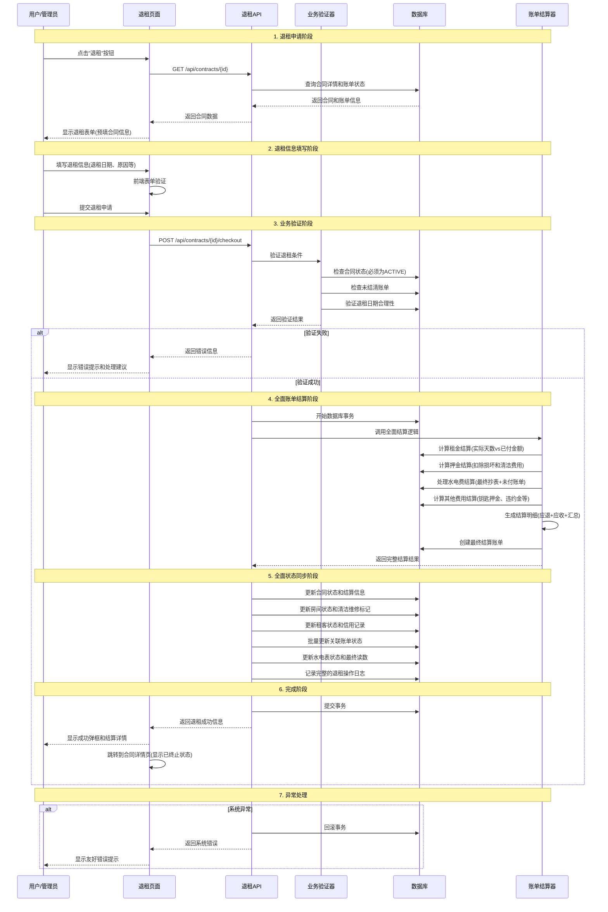

# Rento 退租功能设计方案 v1.0

## 退租业务流程时序图



## 退租功能核心设计要点

### 1. 业务规则设计（基于Rento实际情况）

#### 退租条件验证 <mcreference link="https://blog.csdn.net/qq_1406299528/article/details/134638422" index="1">1</mcreference>
- **合同状态检查**: 只有ACTIVE状态的合同才能申请退租
- **账单结清检查**: 必须结清所有PENDING和OVERDUE状态的账单
- **退租日期验证**: 退租日期不能早于当前日期，不能晚于合同结束日期
- **提前退租处理**: 支持提前退租，但需要按合同条款处理违约金

#### 退租类型支持 <mcreference link="https://cloud.baidu.com/article/3337236" index="4">4</mcreference>
- **正常到期退租**: 合同到期日当天或之前的退租
- **提前退租**: 合同未到期的主动退租
- **违约退租**: 因违反合同条款的强制退租

### 2. 全面账单结算策略（复用现有账单系统）

#### 租金结算逻辑 <mcreference link="https://blog.csdn.net/qq_74915405/article/details/135446523" index="2">2</mcreference>
- **按日精确计算**: 根据实际居住天数计算应付租金
- **预付租金处理**: 计算多付租金的退还金额
- **租金调整处理**: 处理合同期内的租金调整记录

#### 押金处理机制 <mcreference link="https://zhuanlan.zhihu.com/p/618394781" index="3">3</mcreference>
- **房屋检查评估**: 评估房屋损坏情况和维修费用
- **清洁费用扣除**: 根据房屋清洁状况扣除相应费用
- **钥匙押金处理**: 钥匙归还后退还钥匙押金
- **押金退还计算**: 押金 - 损坏费用 - 清洁费用 = 实际退还金额

#### 水电费结算逻辑
- **最终抄表读数**: 获取退租时的最终水电表读数
- **未结算用量**: 计算最后一个周期的水电用量
- **未付账单处理**: 结算所有未支付的水电费账单
- **预付费用退还**: 如有预付水电费，计算退还金额

#### 其他费用结算
- **违约金计算**: 提前退租的违约金计算
- **维修费用**: 租客造成的设施损坏维修费用
- **清洁费用**: 房屋清洁和恢复费用
- **其他杂费**: 合同约定的其他相关费用

#### 结算明细组织展示
```typescript
interface CheckoutSettlement {
  // 应退部分 (租客应收回的金额)
  refundItems: {
    rentRefund: number          // 多付租金退还
    depositRefund: number       // 押金退还
    keyDepositRefund: number    // 钥匙押金退还
    utilityRefund: number       // 水电费预付退还
    otherRefund: number         // 其他费用退还
    subtotal: number            // 应退小计
  }
  
  // 应收部分 (租客应补缴的金额)
  chargeItems: {
    rentCharge: number          // 欠缴租金
    utilityCharge: number       // 水电费欠费
    damageCharge: number        // 损坏赔偿费用
    cleaningCharge: number      // 清洁费用
    penaltyCharge: number       // 违约金
    otherCharge: number         // 其他费用
    subtotal: number            // 应收小计
  }
  
  // 汇总结算
  summary: {
    totalRefund: number         // 总应退金额
    totalCharge: number         // 总应收金额
    netAmount: number           // 净结算金额 (正数=应退给租客，负数=租客应补缴)
    settlementType: 'REFUND' | 'CHARGE' | 'BALANCED'  // 结算类型
  }
  
  // 结算明细描述
  details: Array<{
    category: string            // 费用类别
    description: string         // 详细描述
    amount: number             // 金额 (正数=退还，负数=收取)
    calculation: string        // 计算依据
  }>
}
```

### 3. 全面数据处理策略（与续租功能保持一致）

#### 合同状态处理
- **状态更新**: 将合同状态从ACTIVE更新为TERMINATED
- **结算信息记录**: 记录完整的结算明细和计算依据
- **退租日期**: 记录实际退租日期和申请日期
- **历史保留**: 保留完整的合同历史记录和变更日志

#### 房间状态处理
- **状态重置**: 将房间状态从OCCUPIED更新为VACANT
- **租客信息清理**: 清空currentRenter字段
- **逾期清零**: 重置overdueDays为null
- **维修标记**: 根据房屋检查结果标记是否需要维修
- **清洁标记**: 标记房屋清洁状态和所需清洁工作

#### 租客状态处理
- **合同关联**: 更新租客的活跃合同状态
- **信用记录**: 记录租客的退租表现和信用评分
- **联系状态**: 更新租客的联系状态和地址信息
- **历史记录**: 保留完整的租赁历史记录

#### 关联账单状态处理
- **未付账单**: 批量更新所有未付账单的状态
- **结算账单**: 生成最终的结算账单记录
- **账单归档**: 将所有相关账单标记为已归档
- **支付记录**: 更新最终的支付和结算记录

#### 水电表状态处理
- **最终读数**: 记录退租时的最终水电表读数
- **表计状态**: 将水电表状态更新为INACTIVE或重新分配
- **用量结算**: 完成最后一个周期的用量结算
- **表计归档**: 归档该合同期间的所有抄表记录

#### 关联数据处理
- **账单保留**: 保留所有历史账单记录
- **抄表记录**: 保留完整的抄表历史记录
- **维修记录**: 记录房屋检查和维修情况
- **备注记录**: 在合同备注中记录详细的退租原因和过程
- **文档归档**: 归档相关的合同文档和照片证据

### 4. 技术架构设计

#### API设计
```typescript
// 退租API接口
POST /api/contracts/{id}/checkout
{
  checkoutDate: Date,        // 退租日期
  checkoutReason: string,    // 退租原因
  damageAssessment?: {       // 损坏评估
    items: Array<{
      category: string,      // 损坏类别
      description: string,   // 损坏描述
      amount: number,        // 赔偿金额
      photos?: string[]      // 损坏照片
    }>,
    totalAmount: number      // 总赔偿金额
  },
  cleaningAssessment?: {     // 清洁评估
    level: 'GOOD' | 'FAIR' | 'POOR',  // 清洁等级
    cleaningFee: number,     // 清洁费用
    description?: string     // 清洁说明
  },
  finalMeterReadings?: {     // 最终抄表读数
    electricity?: number,    // 电表读数
    water?: number,         // 水表读数
    readingDate: Date       // 抄表日期
  },
  remarks?: string          // 退租备注
}

// 退租响应接口
interface CheckoutResponse {
  success: boolean
  contractId: string
  settlement: CheckoutSettlement  // 完整结算明细
  updatedEntities: {             // 更新的实体状态
    contract: ContractStatus
    room: RoomStatus
    renter: RenterStatus
    bills: BillStatus[]
    meters: MeterStatus[]
  }
  message: string
}
```

#### 数据库事务
- **原子性操作**: 确保退租过程中的所有数据操作要么全部成功要么全部回滚
- **并发控制**: 防止同一合同被重复退租
- **数据一致性**: 确保合同状态、房间状态、账单数据的一致性

### 5. 用户体验优化（符合Rento现状）

#### 智能表单预填
- **合同信息继承**: 自动填充合同基础信息
- **账单状态检查**: 实时显示未结清账单状态
- **结算预览**: 提供退租费用预览计算

#### 即时反馈机制
- **成功提示**: 使用弹框提示退租成功，显示结算详情
- **进度显示**: 实时显示退租处理进度
- **错误处理**: 友好的错误提示和处理建议

### 6. 风险控制机制

#### 业务风险控制 <mcreference link="https://www.cnblogs.com/Xinghaoawake/p/16760426.html" index="5">5</mcreference>
- **账单检查**: 确保所有账单已结清
- **房屋状态**: 检查房屋损坏情况
- **合同条款**: 严格按照合同条款执行退租

#### 系统风险控制
- **数据备份**: 退租操作前自动备份关键数据
- **操作日志**: 详细记录退租操作的每个步骤
- **权限控制**: 确保只有授权用户可以执行退租操作

## 与现有系统的集成设计

### 1. 复用现有组件和API

#### 账单系统集成
- **复用账单生成**: 使用现有的`auto-bill-generator.ts`
- **复用账单查询**: 使用现有的`billQueries`
- **复用状态管理**: 使用现有的账单状态枚举

#### 合同系统集成
- **复用合同查询**: 使用现有的`contractQueries`
- **复用状态管理**: 使用现有的合同状态枚举
- **复用验证逻辑**: 使用现有的API错误处理

#### 房间系统集成
- **复用房间更新**: 使用现有的`roomQueries.update`
- **复用状态管理**: 使用现有的房间状态枚举

### 2. UI组件设计（与续租功能保持一致）

#### 页面结构
```
CheckoutContractPage (页面组件)
├── PageContainer (页面容器)
├── CheckoutContractHeader (页面头部)
├── CheckoutContractForm (主要内容)
│   ├── OriginalContractInfo (原合同信息展示)
│   ├── CheckoutDateSelector (退租日期选择)
│   ├── DamageAssessmentForm (损坏评估表单)
│   ├── CleaningAssessmentForm (清洁评估表单)
│   ├── FinalMeterReadingForm (最终抄表表单)
│   ├── BillSettlementPreview (账单结算预览)
│   │   ├── RefundItemsDisplay (应退项目展示)
│   │   ├── ChargeItemsDisplay (应收项目展示)
│   │   └── SettlementSummary (结算汇总)
│   └── CheckoutActions (退租操作)
└── LoadingState (加载状态)
```

#### 结算预览组件设计
```typescript
// 结算预览组件
interface BillSettlementPreviewProps {
  contractData: ContractWithDetails
  checkoutDate: Date
  damageAssessment?: DamageAssessment
  cleaningAssessment?: CleaningAssessment
  finalMeterReadings?: FinalMeterReadings
}

// 应退项目展示组件
function RefundItemsDisplay({ refundItems }: { refundItems: RefundItems }) {
  return (
    <div className="bg-green-50 p-4 rounded-lg">
      <h4 className="font-semibold text-green-800 mb-3">应退项目</h4>
      <div className="space-y-2">
        {refundItems.rentRefund > 0 && (
          <div className="flex justify-between">
            <span>多付租金退还</span>
            <span className="text-green-600">+¥{refundItems.rentRefund.toFixed(2)}</span>
          </div>
        )}
        {refundItems.depositRefund > 0 && (
          <div className="flex justify-between">
            <span>押金退还</span>
            <span className="text-green-600">+¥{refundItems.depositRefund.toFixed(2)}</span>
          </div>
        )}
        {/* 其他应退项目... */}
        <div className="border-t pt-2 font-semibold">
          <div className="flex justify-between">
            <span>应退小计</span>
            <span className="text-green-600">+¥{refundItems.subtotal.toFixed(2)}</span>
          </div>
        </div>
      </div>
    </div>
  )
}

// 应收项目展示组件
function ChargeItemsDisplay({ chargeItems }: { chargeItems: ChargeItems }) {
  return (
    <div className="bg-red-50 p-4 rounded-lg">
      <h4 className="font-semibold text-red-800 mb-3">应收项目</h4>
      <div className="space-y-2">
        {chargeItems.rentCharge > 0 && (
          <div className="flex justify-between">
            <span>欠缴租金</span>
            <span className="text-red-600">-¥{chargeItems.rentCharge.toFixed(2)}</span>
          </div>
        )}
        {chargeItems.damageCharge > 0 && (
          <div className="flex justify-between">
            <span>损坏赔偿</span>
            <span className="text-red-600">-¥{chargeItems.damageCharge.toFixed(2)}</span>
          </div>
        )}
        {/* 其他应收项目... */}
        <div className="border-t pt-2 font-semibold">
          <div className="flex justify-between">
            <span>应收小计</span>
            <span className="text-red-600">-¥{chargeItems.subtotal.toFixed(2)}</span>
          </div>
        </div>
      </div>
    </div>
  )
}

// 结算汇总组件
function SettlementSummary({ summary }: { summary: SettlementSummary }) {
  const isRefund = summary.netAmount > 0
  const isCharge = summary.netAmount < 0
  const isBalanced = summary.netAmount === 0
  
  return (
    <div className={`p-4 rounded-lg border-2 ${
      isRefund ? 'bg-green-100 border-green-300' :
      isCharge ? 'bg-red-100 border-red-300' :
      'bg-gray-100 border-gray-300'
    }`}>
      <h4 className="font-bold text-lg mb-3">结算汇总</h4>
      <div className="space-y-2">
        <div className="flex justify-between">
          <span>总应退金额</span>
          <span className="text-green-600">¥{summary.totalRefund.toFixed(2)}</span>
        </div>
        <div className="flex justify-between">
          <span>总应收金额</span>
          <span className="text-red-600">¥{summary.totalCharge.toFixed(2)}</span>
        </div>
        <div className="border-t-2 pt-2">
          <div className="flex justify-between text-xl font-bold">
            <span>净结算金额</span>
            <span className={
              isRefund ? 'text-green-600' :
              isCharge ? 'text-red-600' :
              'text-gray-600'
            }>
              {isRefund && '+'}¥{Math.abs(summary.netAmount).toFixed(2)}
            </span>
          </div>
          <div className="text-sm text-gray-600 mt-1">
            {isRefund && '应退还给租客'}
            {isCharge && '租客应补缴'}
            {isBalanced && '收支平衡'}
          </div>
        </div>
      </div>
    </div>
  )
}
```

#### 操作按钮设计
- **位置**: 与续租按钮并列显示在合同详情页
- **样式**: 橙色边框，悬停时橙色背景
- **图标**: UserX图标，表示用户离开
- **条件**: 仅在合同状态为ACTIVE时显示

### 3. 路由设计

#### 页面路由
- **退租页面**: `/contracts/[id]/checkout`
- **API路由**: `/api/contracts/[id]/checkout`

#### 导航流程
- **入口**: 合同详情页的"退租"按钮
- **流程**: 退租表单 → 确认退租 → 成功页面 → 返回合同详情
- **返回**: 退租完成后返回合同详情页，显示TERMINATED状态

## 实施建议

### 1. 开发优先级
1. **高优先级**: API接口实现和核心业务逻辑
2. **中优先级**: UI组件和页面实现
3. **低优先级**: 高级功能和优化

### 2. 复用策略
- **最大化复用**: 复用现有的合同、账单、房间管理逻辑
- **保持一致**: 与续租功能保持相同的设计模式和用户体验
- **简化实现**: 避免重复开发，专注于退租特有的业务逻辑

### 3. 测试策略
- **单元测试**: 重点测试账单结算逻辑的准确性
- **集成测试**: 测试退租流程的完整性和数据一致性
- **用户测试**: 验证用户体验和操作流程的合理性

### 4. 风险控制
- **数据安全**: 确保退租操作的数据安全和可恢复性
- **业务规则**: 严格执行退租业务规则，防止数据错误
- **用户体验**: 提供清晰的操作指引和错误处理

这个优化后的退租功能设计方案完全基于Rento项目的实际情况，充分复用现有的系统架构和组件，确保与续租功能保持一致的用户体验，同时满足房屋租赁管理的实际业务需求。