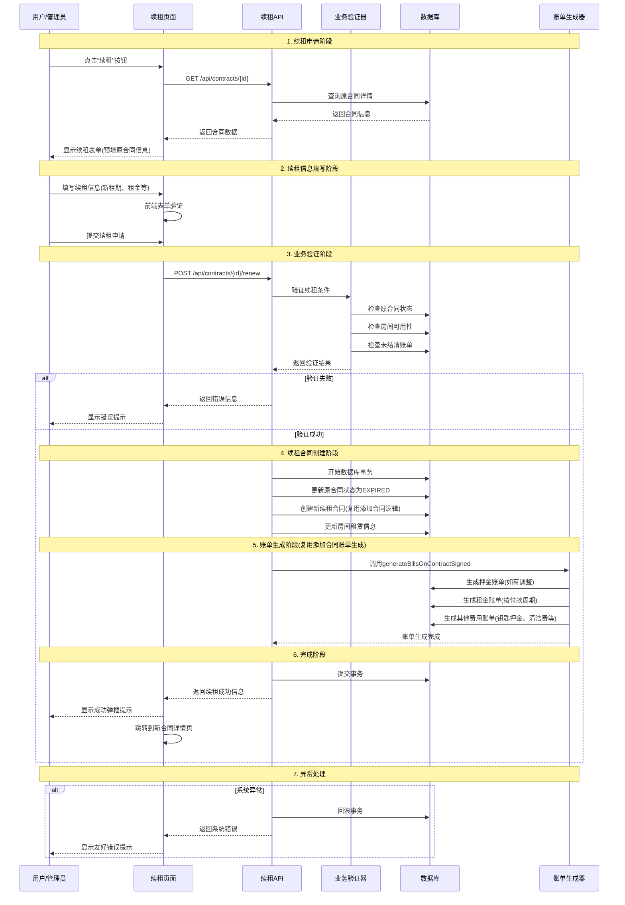

# Rento 续租功能设计方案 v2.0

## 续租业务流程时序图



## 续租功能核心设计要点 v2.0

### 1. 业务规则设计（基于Rento实际情况）

#### 续租条件验证
- **原合同状态检查**: 只有ACTIVE或即将到期的合同才能续租
- **房间可用性**: 确保房间在新租期内可用
- **未结清账单检查**: 确保原合同无未结清费用（替代信用检查）
- **时间逻辑**: 新合同开始时间应与原合同结束时间衔接

#### 续租类型支持
- **无缝续租**: 原合同到期当天开始新合同
- **提前续租**: 原合同未到期但提前签署续租协议
- **间隔续租**: 原合同结束后间隔一段时间再续租

### 2. 数据处理策略（复用添加合同逻辑）

#### 合同关系处理
- **原合同处理**: 状态更新为EXPIRED，保留历史记录
- **新合同创建**: 复用添加合同的创建逻辑，生成新的合同编号，继承基础信息
- **关联关系**: 通过备注字段记录续租关系（如："续租自合同CT202509669207"）

#### 租金调整机制
- **市场价格调整**: 支持根据市场行情调整租金
- **阶梯式调整**: 支持分期调整租金价格
- **优惠政策**: 支持长期租户优惠政策

### 3. 账单生成逻辑（完全复用添加合同实现）

#### 自动账单生成
- **复用现有逻辑**: 直接调用`generateBillsOnContractSigned(newContractId)`
- **押金处理**: 根据新旧押金差额生成补缴或退还账单
- **租金账单**: 按新的付款周期生成租金账单（月付/季付/年付）
- **其他费用**: 钥匙押金、清洁费等按需生成

#### 账单生成一致性保障
- **触发器类型**: 使用`BillTriggerType.CONTRACT_RENEWAL`标识续租触发
- **生成规则**: 完全遵循添加合同时的账单生成规则
- **数据一致性**: 确保合同信息与账单信息完全一致

### 4. 技术架构设计

#### API设计
```typescript
// 续租API接口
POST /api/contracts/{id}/renew
{
  newStartDate: Date,
  newEndDate: Date,
  newMonthlyRent: number,
  newDeposit?: number,
  paymentMethod?: string,
  remarks?: string
}
```

#### 数据库事务
- **原子性操作**: 确保续租过程中的所有数据操作要么全部成功要么全部回滚
- **并发控制**: 防止同一合同被重复续租
- **数据一致性**: 确保房间状态、租客信息、账单数据的一致性

### 5. 用户体验优化（符合Rento现状）

#### 智能表单预填
- **历史数据继承**: 自动填充原合同的基础信息
- **智能建议**: 根据历史数据提供租金建议
- **快速续租**: 提供一键续租功能，使用默认参数

#### 即时反馈机制
- **成功提示**: 使用弹框提示续租成功，无需短信/邮件通知
- **进度显示**: 实时显示续租处理进度
- **错误处理**: 友好的错误提示和处理建议

### 6. 风险控制机制

#### 业务风险控制
- **欠费检查**: 确保原合同无未结清费用（替代信用评估）
- **房屋状态**: 检查房屋是否需要维修或升级
- **合同冲突**: 防止时间重叠的合同冲突

#### 系统风险控制
- **数据备份**: 续租操作前自动备份关键数据
- **操作日志**: 详细记录续租操作的每个步骤
- **权限控制**: 确保只有授权用户可以执行续租操作

## 实施建议

1. **复用现有代码**: 最大化复用添加合同的逻辑，确保一致性
2. **简化通知机制**: 使用页面弹框提示，符合当前Rento的交互模式
3. **数据一致性**: 确保续租合同与原合同的数据关联和追溯
4. **渐进式实施**: 先实现基础续租功能，再逐步完善高级特性

这个优化后的设计方案更贴近Rento项目的实际情况，去除了不必要的复杂性，强调了与现有添加合同功能的一致性和复用性。